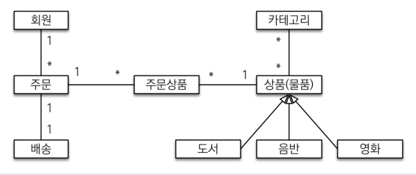
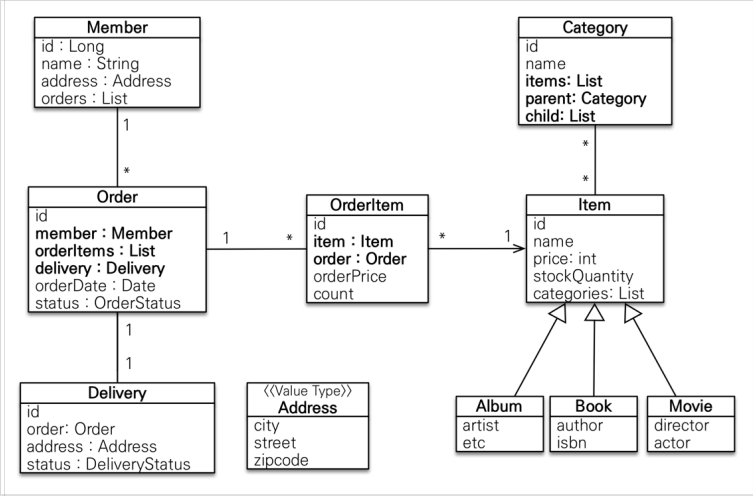
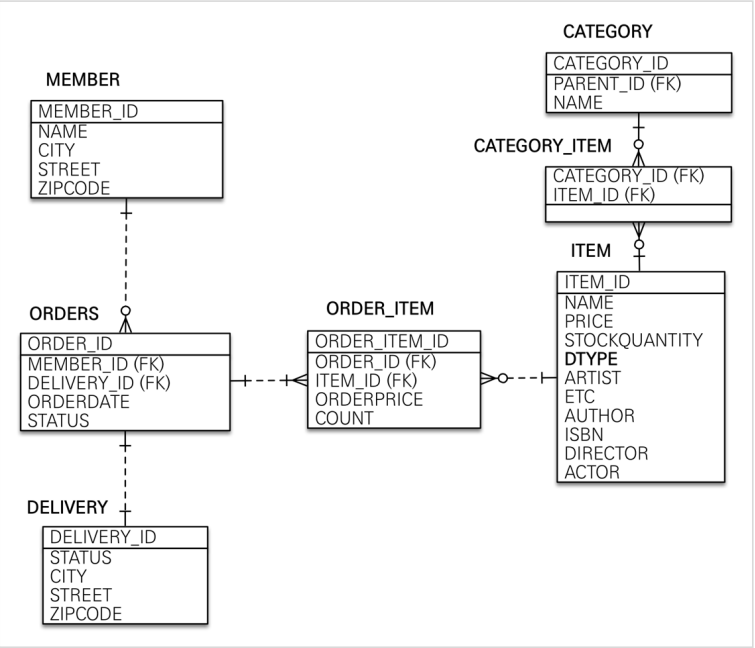

# 기능목록

- 회원 기능
  - 회원 등록
  - 회원 조회
- 상품 기능
  - 상품 등록
  - 상품 수정
  - 상품 조회
- 주문 기능
  - 상품 주문
  - 주문 내역 조회
  - 주문 취소
- 기타 요구사항
  - 상품은 재고 관리가 필요하다.
  - 상품의 종류는 도서, 음반, 영화가 있다.
  - 상품을 카테고리로 구분할 수 있다.
  

