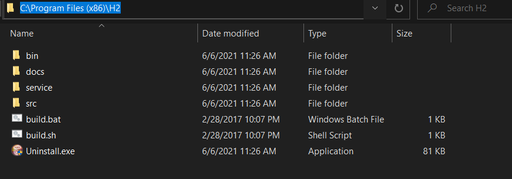
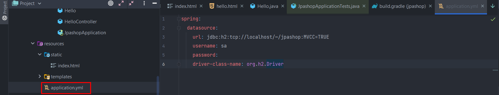
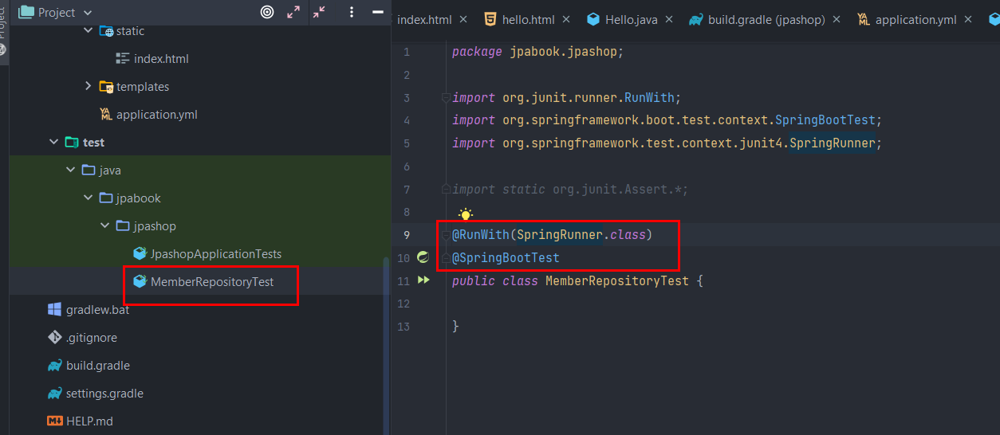

# 프로젝트 환경설정

## 프로젝트 생성

## 라이브러리 살펴보기

jdbc -> hikari cp 사용 : https://brunch.co.kr/@jehovah/24

hikari 커넥션풀로 운영에서도 많이 쓰임.

slf4j -> interface의 모음 : 구현체로 logback, log4j, log4j2 등을 갈아끼우며 쓸 수 있음.

(slf4j에 logback쓰는게 대세 -> 운영에서 거의다 이렇게 씀.)

## View 환경 설정

스프링은 thymeleaf를 민다. Thymeleaf는 html mark up안에 넣어서 해결

natural templates으로, html markup을 깨지 않고 (if문 같은걸 안씀) 그대로 쓴다.

여기서 장점이 있다. (보통 프리마커는 웹브라우저에서 안열리는데 타임리프는 열림.)

2점대에 엄청 불편했었음. ( 원래는 ` ` 한번만 쓰면 됬는데 타임리프는 `  ` 꼭 맞춰써야 했다. 또 성능 이슈도 있었음.)

3.0 이상부터 많이 개선됬다고함.

무엇보다 스프링과 integration이 된다는 것이 좋음.

또 단점은 if 이런거 쓰는 대신 매뉴얼을 많이 봐야한다. 익숙해지면 편하다고 함.

요즘은 템플릿 엔진(서버사이드 렌더링) 보다는 뷰나 리액트(CSR)가 많이쓰긴 하지만 

어드민 같은거 만들때 템플릿 많이 쓴다.

참고 :

스프링 공부하면서 모르는 것들은 

https://spring.io/guides 

여기가 진짜 짱이다. 검색해서 api, restful 모르면 다 나온다. 이론적인 책 보기전에 먼저 이런거 참고하는게 좋다!

> 타임리프 : https://docs.spring.io/spring-boot/docs/2.1.7.RELEASE/reference/html/boot-features-developing-web-applications.html#boot-features-spring-mvc-template-engines

위 HelloController에서 Model이 뭐냐?

Model에다가 데이터를 넣어서 View에다가 넘길 수있다. (Controller에서 data를 view로 넘길 수 있음)

지금 같은 경우는 name이 data인 key에 값이 hello!!! 라는 값을 넘긴다.

그다음에 return "hello"를 하는데, 이거는 화면 이름이다. 

관례상으로 hello.html을 리턴하는 것과 마찬가지다. 그럼 이 hello.html을 만들어야 하는데,

templates가 있는데, 템플릿 엔진이라서 templates라고 생각하면 된다. 이 폴더에다가 hello.html을 만들면 된다. 

이렇게 하면 return "hello" 하게 되면 그 결과로 resoures/templates/hello.html 이 리턴되게 된다.

hello.html을 보면 기본적인 markup과 차이가 있는데, 

html의 name space로 thymeleaf를 주고 있다. (xmlns 부분)

그리고 p th:text라는게 있는데, 아까 hello 컨트롤러에서 타고온 data key의 value가 들어오게 된다. 

그리고 태그 안에있는 `안녕하세요. 손님`은 순수하게 html을 렌더링 할 때 나온다. 그게 아니라 서버 렌더링을 타면 `안녕하세요. + data`가 렌더링 되게 된다!

이게 바로 타임리프의 장점이다. 따른 템플릿 엔진이었다면 if 어쩌구저쩌구 보이며 난리난다..

이걸로 서버 사이드 렌더링 할 수 있다!

페이지 소스를 보면 서버사이드 렌더링으로 p 태그가 잘 렌더링 되어 나온다. (서버를 띄운 상태임)

근데 여기서 궁금한 점이 있을 수 있는데, return "hello"만 했을 뿐인데 어떻게 resources/templates/hello.html을 찾을 수 있는가? 라고 궁금할 수 있는데, 스프링 부트의 타임 리프가 기본적으로 설정 걸어준다. 

타임리프는

`resource:templates/` + {ViewName} + `.html` 

이렇게 맵핑을 해준다. 만약 설정을 바꾸고 싶다면 부트쪽 매뉴얼로 들어가서 설정을 바꿀 수 있다.

만약 렌더링 안하고 완전 정적인 페이지를(순수한 HTML) 뿌리고 싶다면?

resources 폴더의 static 폴더에다가 index.html을 만들면 된다.

그냥 localhost:8080 으로 접속하면 바로 뜬다. 그리고 hello는 a 레퍼런스로 /hello를 걸었으므로

아까 우리가 만든 hello.html을 뿌려주는 페이지로 이동하게 된다.

`참고` : 기본적으로 html 파일들은 resources 폴더에 있기 때문에 변경 사항이 생기면 항상 서버를 다시 재 시작 시켜야 함.

근데 우리가 이 타임리프를 건드려야 할 상황이 많이 생기는데, 그때마다 서버를 재가동 시키는게 너무 비효율적이다. 그래서 이거를 해결할 수 있는 방법으로는 

devtools 라이브러리를 넣어주면 된다. 

얘는 개발할때 도움되는 기능들을 많이 제공해 준다. 얘를 쓰면 캐시를 다 없애주고 리로딩 되게 만들어 준다.

이렇게 하면 타임리프 를 바꾸고 서버를 재가동 하지않아도 변경사항이 실시간으로 등록된다.

그래들만 등록하면 안되고 build 탭의 recompile을 해줘야 리렌더링 된다!

## H2 데이터베이스 설치

h2 데이터베이스 홈페이지에서 받은 폴더를 H2 폴더에다 압축 해제한다.

bin 폴더로 들어가서 

실행한다. (그냥 파일을 더블 클릭해도 실행됨)

그럼 h2 콘솔이 실행됨s

mysql 써도 되지만 h2 데이터베이스가 메모리로 쓸 수도 있어서 편함.

그리고 ip 주소를 localhost로 바꿔주면 잘 뜬다. 이때 저 네모표시의 키값을 유지시켜줘야 한다.

왜냐면 처음에 최초 한번은 세션키를 유지한 상태로 실행해야 하기 때문이다. jdbc:h2:~/jpashop 이라고 되있는데,

~/jpashop에다가 db파일을 만들어 주도록 경로를 지정해 줘야한다. 이렇게 해서 연결을 누르게 되면 

이렇게 들어가진다.

~(home)에 jpashop.mv.db 파일이 생성되게 된다.

그리고 나서 접근을 끊어주고 그다음 부터는 이미 파일이 생성되어 있기 때문에

`jdbc:h2:tcp://localhost/~/jpashop` 이렇게 접속하면 된다.

파일 생성할때 권한도 필요하고 세션키도 물고 있어야 생성된다. 그 이후부터는 jdbc url의 tcp를 이용하여 네트워크 모드로 접근할 수 있다.

참고로 웹 콘솔에서 ./h2.bat을 꺼버리면 db가 내려가므로, 항상 켜놓고 작업해야 한다.

## JPA와 DB 설정, 동작 확인

org.h2.Driver 로 드라이버 클래스 네임 속성을 등록하면 데이터베이스 커넥션과 관련된 설정이 완료가 된다.

이렇게 만 해도 hikariCP를 써서 커넥션 풀을 스프링 부트가 셋팅을 다 걸어준다.

이런 셋팅들은 전부 

https://docs.spring.io/spring-boot/docs/2.1.7.RELEASE/reference/html/

에서 공부해야 한다.

spring.jpa.properties:hibernate.show_sql은 system printout으로 sql을 찍지만

logging.level.org.hibernate.SQL은 로거로 찍는다.

실제로 운영환경에서 로거는 시스템 프린트아웃으로 찍으면 안되고 로거를 통해서 찍어야 한다.

ddl-auto가 create인건 어플리케이션이 실행되는 시점에 내가 만든 엔티티의 정보들을 보고 테이블을 지우고 다시 생성한다.

우리는 스프링 부트를 쓰기 때문에 스프링 컨테이너 위에서 모든게 동작한다. 그래서 스프링 부트가 @PersistenceContext가 있으면 스프링 부트가 EntityManger를 주입시켜 준다. (엔티티 매니저 팩토리, 엔티티 매니저 생성을 스프링부트가 @PersistenceContext 읽고 다해줌.)

어디서 이걸 해주나?

build.gradle에 이미 라이브러리를 등록해 놨기 때문에 스프링 부트가 알아서 다 해준다.

그리고 여기있는 설정 파일을 다 읽어서 

엔티티 매니저 ,팩토리 코드가 다 생성되서 그냥 쓰기만 하면 된다.

여기서 굳이 멤버를 반환하지 않고 id를 반환하는 이유는

커맨드랑 쿼리를 분리하라는 원칙에 의해, 저장하고 나면 사이드 이펙트를 일으키는 커맨드성이기 떄문에 가급적이면  리턴 값을 거의 안만든다. 대신에 아이디 정도있으면 다음에 다시 조회할 수 있으니까 이런식으로 보통 설계한다.

이제 테스트를 해본다.

스프링 부트로 테스트 하기 위한 애노테이션과

junit한테 스프링과 관련된 테스트를 할꺼라고 runwith로 알려줘야 한다.

참고

멤버레퍼지토리 테스트를 할거니까 autowired로 인젝션 받는다.

잘 한거 같은데 왜 에러? No EntityManger with actual transaction라고 뜬다. 즉 트랜잭션이 없다는 얘기다.

엔티티매니저를 통한 모든 데이터 변경은 항상 트랜잭션 안에서 이루어져야한다.

(기본편에서 강조 했음)

그래서 트랜잭션이 꼭 있어야 한다! 우선은 이 테스트 메서드에만 트랜잭션을 건다.

참고로 Transactional 애노테이션이 2개있는데, 스프링 프레임워크에서 제공해주는 애노테이션을 import하는걸 권장한다. 왜냐면 우리는 스프링 프레임워크를 사용하고 있기 때문이고, 쓸 수있는 옵션도 많다.

그러면 테스트가 성공하게 된다.

그리고 테스트 실행시 hibernate가 테이블이 있는지 확인후 drop 한다음 create table을 해줬기 때문에 (설정 파일에서 ddl-auto를 create 했기 때문)

멤버 테이블이 생성된다.

근데 member를 저장했는데, 테이블에 저장은 안되어있다. 스프링을 많이 쓴 사람은 알겠지만 

@Transactional 애노테이션이 테스트 케이스에 있으면 테스트가 끝나고 바로 롤백을 해버린다.

일반적으로 테스트가 아닌곳에 트랜젹선을 걸면 정상적으로 잘 동작하는데, 테스트 케이스에 쓰면 정상적으로 작동한 뒤 디비를 롤백해버린다. (근데 사실 이게 맞는거다. 데이터가 계속 들어가 있으면 반복적인 테스트를 할 수 없으니까)

실제로 db 롤백을 하는 로깅을 확인할 수 있다.

근데 db에 저장되는걸 내눈으로 확인하고 싶다면?

롤백을 false하고 돌려준다.

그럼 insert가 뜨면서 (**롤백 FALSE를 안했을 때는 실제로 커밋하지 않았기 때문에 insert가 날아가지 않았음**) 커밋을 하고 db에 반영한다.

데이터가 들어와 있는걸 확인할 수 있다.

@Rollback(false) 애노테이션을 넣음으로써 커밋을 해버리는거다.

추가적으로

저장한거랑 조회한거랑 같을까?

결과적으로는 같게 나온다. 기본편에서도 얘기했다.

true가 나온다.

저장하고 조회하면 영속성 컨텍스트는 똑같다. 같은 영속성 컨텍스트 안에서는 id 값(식별자)이 같으면 같은 identity로 식별한다.

그리고 이미 영속성 컨텍스트에 같은 아이디를 가진 아이덴티티가 똑같이 있기 때문에 그냥 기존에 관리하던게 나와 버리는 거다. (이미 영속성 컨텍스트에 id가 같은 엔티티가 똑같이 관리되고 있기 때문이다. 그래서 그냥 1차 캐시에서 끄집어 내주면 끝임)

그래서 자세히 보면 insert 쿼리만 나가고 select 쿼리는 나오지도 않는다.

즉, 영속성 컨텍스에 있네? 하고 그냥 1차 캐시에서 꺼내와 버리는 거다.

(이게 이해가 안가면 기본편을 쭉 들어야 한다)

jar를 빌드해서 동작을 확인할 수 있는데, 

다음과 같이 clean하고 build한s다.

그러면 build 폴더의 libs 폴더에s jpashop jar파일이 생기게 되고, 

자바로 jar파일을 실행시킨다. (실제 배포할 때 이런식으로 배포가 이루어 진다.)

#### 꿀팁

쿼리파라미터 로그 남기기

jpa를 쓰다보면 sql이나 데이터베이스 커넥션이 어느 타이밍이 일어나는지 궁금할 때가 많다.

지금은 이렇게 쿼리파라미터가 안남고 물음표로 남는다;

가끔 공부, 개발할때 답답하다.. 

첫번째 방법으로는 설정파일에 type을 trace로 둬서 쿼리 파라미터를 찍는다.

이거도 물음표가 있긴하지만 밑에 trace로 어떤 파라미터인지 알려준다.

근데 여기서 만족못한다.. 뭔가 저 물음표를 채우고 싶다.

그때는 외부 라이브러리를 사용하면 된다.

https://github.com/gavlyukovskiy/spring-boot-data-source-decorator

스프링 부트 데이터 소스 데코레이터라는 게있는데,

데이터베이스 커넥션을 매핑해서 왔다갔다 만들어지는 sql statement를 이해해서 로그로 출력해주는 라이브러리가 많다.

그중에서 우리는 P6Spy를 써본다.

그냥 이거만 추가하면 된다. (최신버전이 1.7.1 이라고 되있는데, 실제로 저 부분 복붙하고 1.7.1을 따로 써줘야 함)

실행하면 데이터 커넥션 상황과 파라미터를 알려준다!

참고로 이런 쿼리 파라미터 로그 남기는 라이브러리들은 개발단계에서는 편하지만 운영 및 배포 단계에서는 좀 고민을 해봐야 한다. 운영에도 쓰면 좋겠다는 생각이 들겠지만 성능 테스트를 꼭 해봐야 한다.

이런 것들이 성능을 저하시킬 수도 있기 때문에 (병목이 될 수 있기 때문에) 성능 테스트 해보고 받아 들일만 하면 쓰고, 그게 아니면 개발 용도로 쓰는걸 추천한다.
