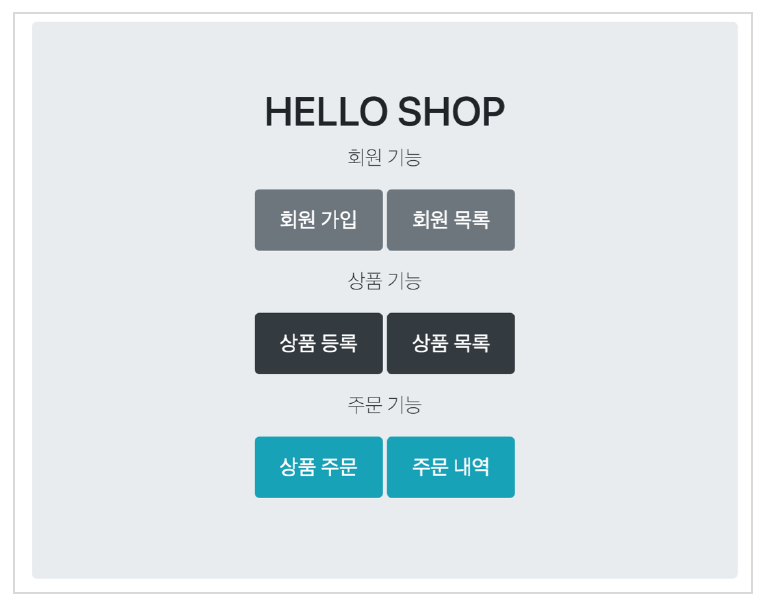
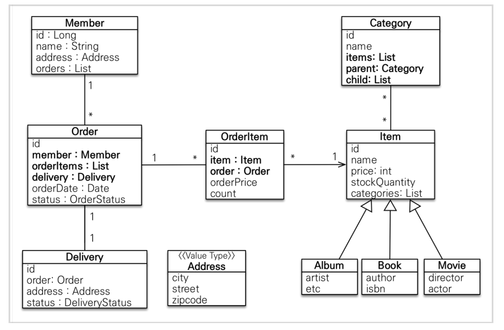
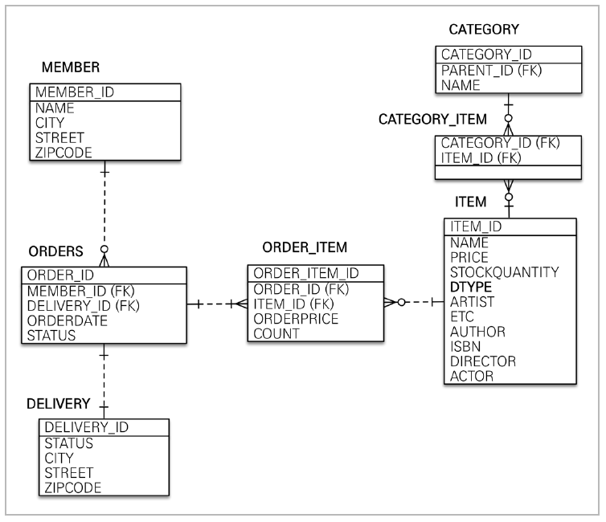
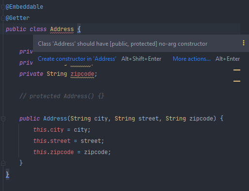

# 도메인 분석 설계

## 목차

- 요구사항 분석
- 도메인 모델과 테이블 설계
- 엔티티 클래스 개발
- 엔티티 설계시 주의점

### 요구사항 분석



간단한 쇼핑몰 이다.

#### 기능 목록

- 회원 기능
  - 회원 등록
  - 회원 조회
- 상품 기능
  - 상품 등록
  - 상품 수정
  - 상품 조회
- 주문 기능
  - 상품 주문
  - 주문 내역 조회
  - 주문 취소
- 기타 요구사항
  - 상품은 재고 관리가 필요하다.
  - 상품의 종류는 도서, 음반, 영화가 있다.
  - 상품을 카테고리로 구분할 수 있다.
  - 상품 주문시 배송 정보를 입력할 수 있다.

### 도메인 모델과 테이블 설계

#### 엔티티 분석



실제로 이건 실무에서 사용하기 애매한것들이 있다.

예를들어 다대다는 운영에서 쓰면 안된다. (기본편에서 계속 얘기함 결국 이런건 일대다 다대일로 풀어내야함)

그리고 member도 order를 가지고, order도 member를 가지는 양방향을 쓰고있는데, 가급적이면 설계단계에서 양방향을 쓰지 말고 단방향을 쓰라고 설계 단계에서 얘기했지만, 예제니까 다양한 관계를 표현하기 위해서 양방향 연관관계를 쓴거다.

사실 개발자들이 처음 객체지향을 공부하며 실수하는게 바로 이거다.

`회원이 주문하니까 회원에 orders list를 두고 하면 되겠구나 ..!` 바로 이 생각은 그냥 사람 생각인거고..

시스템 관점에서는 member랑 order랑 동급으로 놓고 고민해야 한다!

즉, 회원을 통해서 주문이 일어나는게 아니라 주문을 생성할때 회원이 필요하다고 보는게 더 맞다!

생각해보면 쿼리로 볼때도 주문 내역이 필요하면 멤버를 찾아서 거기있는 리스트를 찾아오는게 아니라

주문에서 그냥 필터링 조건으로 멤버가 들어갈 뿐인거다.

그래서 사실상 멤버에서 오더로의 방향은 사실 필요가 없다. 

그냥 풍성한 예제를 살펴보려고 넣은 것이라 이해하면 된다.


오더 아이템과 아이템 테이블 관계의 경우, 다대일 관계인데, 오더아이템에서 아이템으로 가는 단방향으로 설계한다. 생각해보면 사실 아이템 테이블에서 오더아이템 테이블로 갈 일이 거의 없다. (`나를 주문한 오더아이템을 다 찾아!` 경우가 거의 없다. 반대로 `내가 주문한 오더아이템을 다 찾아!` 는 많다.) -> 그냥 오더아이템을 통해 아이템을 보면 됨.

#### 테이블 분석



Member, Delivery 테이블에는 Address 값들이 들어있음. Item 테이블은 single table 전략을 씀.

관계형 데이터베이스에서 일대다 관계에서 외래키는 무조건 `다` 에 존재한다.

외래키가 있는 ORDERS를 연관관계의 주인으로 정하는 것이 좋다. 즉, Order.member를 ORDERS.MEMBER_ID 외래키와 매핑한다.

> 참고 : 연관관계의 주인쪽에 값을 셋팅해야 값이 변경된다. 반대편 쪽은 (mapped by) 단순히 조회만 가능하다.

카테고리 테이블과 아이템 테이블은 데이터베이스 설계상 반드시 카테고리 아이템 테이블이 중계 테이블로 존재해야 함.

> 참고 : db에서는 보통 대/소문자 + _(언더스코어) 스타일을 사용한다.

### 엔티티 클래스 개발

양방향으로 연관관계가 매핑되어 있을때,  JPA에서는 외래키를 두개의 엔티티중 어디값이 변경됬을때 외래키를 업데이트 칠지 모른다. 그래서 JPA에서는 규약으로 맞춰서 둘중의 하나를 `연관관계의 주인`을 정해서 업데이트 쿼리를 칠 것을 정해준다.


이전에 Date 객체를 쓸때는 별도의 어노테이션을 붙여야 했는데, 자바8부터는 LocalDateTime 객체를 쓰면 하이버네이트가 알아서 지원해준다.


일대일 매핑에서 외래키는 주로 접근을 많이 하는 쪽에 둔다. Order와 Delivery중 주문을 보면서 배송을 보기 때문에 주문 테이블에서 외래키를 관리하도록 한다.


외래키걸기 -> 시스템마다 다르다. 실시간 트래픽이 많고 정합성보다 잘 서비스되고 유연성이 더 중요하다면 외래키 빼고 인덱스만 잘잡아 주면되는데, 돈과 관련된 엄청 중요하고 데이터가 항상 맞아야 된다면 외래키를 거는것에 진지하게 고민해봐야 한다.

 

엔티티 개발할때 데이터 조회할일이 너무많아서 getter는 열어주는게 편함. 근데 setter는 데이터를 변화시키기 때문에 막 열어 두면 데이터가 언제 변경됬는지 추적하기 힘듦. 그래서 엔티티 변경 시에는 setter를 다 닫고 변경 지점이 명확하도록 비즈니스 메서드를 별도로 제공해야 함.


```java
@Embeddable
@Getter
public class Address {

	private String city;
	private String street;
	private String zipcode;

	protected Address() {}

	public Address(String city, String street, String zipcode) {
		this.city = city;
		this.street = street;
		this.zipcode = zipcode;
	}
}
```

값 타입의 경우 getter만 열어서 데이터를 생성 시점에만 set할수있게 한다. (값 타입은 변경 불가능하게 설계해야 한다.)



근데 기본 생성자는 반드시 필요한데, JPA 기본스펙으로, JPA가 이런 Address를 생성할 때 reflection이나 proxy를 써야하는데, 그때 기본 생성자가 필요하기 때문이다. (이때 public을 쓰면 어디서든 쓸 수 있으니까, proteced까지는 허용해 준다.) -> proteced 하면 기본생성자를 막 new 할 수없게 막는다.


## 엔티티 설계시 주의점

#### 모든 연관관계는 지연로딩으로 설정!

연관관계 지연로딩! -> 연관된 엔티티를 함께 db에서 조회할 때만 fetch join 또는 엔티티 그래프 탐색이용.

 lazy 로딩이 트랜잭션 밖에서 안되는 이슈(LazyLoadingException) 때문에 eager를 썼다고 하기도 하는데, 이것도 다 대안이 있음. 트랜잭션을 좀더 빨리 가져온다거나 상황에 따라서 OpenSession 등을 써서 해결할 수 있음.

#### 컬렉션은 필드에서 초기화 하자.

```java
@Entity
@Getter @Setter
public class Member {
    
    ...
        
    @OneToMany(mappedBy = "member")
    private List<Order> orders;
    
    public Member() {
        orders = new ArrayList<>();
    }
}
```

```java
@Entity
@Getter @Setter
public class Member {
    
    ...
        
    @OneToMany(mappedBy = "member")
    private List<Order> orders = new ArrayList<>();
}
```

둘 중 어느것이 best practice냐고 했을때, 아래가 맞다. (하이버네이트에서 가이드가 있음)

아래는 초기화에 대한 걱정이 없다. (NPE가 날 일이 없다.) 궁극적으로는 아래 설명할 이유 때문

```JAVA
Member member = new Member();
System.out.println(member.getOrders().getClass());
em.persist(team);
System.out.println(member.getOrders().getClass());

//출력 결과
class java.util.ArrayList
class org.hibernate.collection.internal.PersistentBag // 하이버네이트는 엔티티를 영속화 할때, 컬렉션을 감싸고 하이버네이트가 제공하는 내장 컬렉션으로 변경함. (그래서 여기에 누가 다시 컬렉션을 바꾸면 하이버네이트 내부 메커니즘에 문제가 생김)
```

위 코드에서 new Member() 로 생성자를 적용할때 orders에 컬렉션을 적용한다고 하자. member.getOrders() 할때, 생성자에서 컬렉션을 잘못 생성하게 된다면 하이버 네이트 내부 메커니즘에 문제가 발생할 수 있어서 필드 레벨에서 컬렉션을 지정하고 그대로 사용하는게 best practice다.


#### 테이블, 컬럼명 생성 전략

하이버네이트 기존 구현: 엔티티의 필드명을 그대로 테이블의 컬럼명으로 사용 -> `SpringPhysicalNamingStrategy`

스프링 부트에서 엔티티와 테이블 이름 매핑을 다음과 같이 해줌. (엔티티(필드) -> 테이블(컬럼))

1. 카멜 케이스 언더스코어(memberPoint member_point)
2. .(점) _(언더스코어)
3. 대문자 소문자

스프링부트의 기본설정은 아래와 같다.

1. 논리명 생성: 명시적으로 컬럼, 테이블명을 직접 적지 않으면 ImplicitNamingStrategy 사용
spring.jpa.hibernate.naming.implicit-strategy : 테이블이나, 컬럼명을 명시하지 않을 때 논리명
적용,
2. 물리명 적용:
spring.jpa.hibernate.naming.physical-strategy : 모든 논리명에 적용됨, 실제 테이블에 적용
(username usernm 등으로 회사 룰로 바꿀 수 있음)


#### cascade

`cascase 사용전`

```java
persist(orderItemA)

persist(orderItemB)

persist(orderItemC)

persist(order)
```

`cascade 사용후`

```java
//persist 전파 -> orderItem까지 persist 됨 (delete도 마찬가지로 됨.)
persist(order)
```


#### 연관관계 편의 메서드

양방향에서는 연관관계 편의 메서드가 있으면 좋다.

```java
... 
Member member = new Member();
Order order = new Order();

// 양방향이므로 둘다 set 해줘야 함.
member.getOrders().add(order);
order.setMember(member);
...
```

이걸 비즈니스 로직에 치면 깜빡할 수 있으니

```java
@Entity
@Table(name = "orders")
@Getter
@Setter
public class Order {

	...

	// == 연관관계 편의 메서드 == //
	public void setMember(Member member) {
		this.member = member;
		member.getOrders().add(this);
	}
}
```

 연관관계 편의 메소드를 만든다.

```java
... 
Member member = new Member();
Order order = new Order();

order.setMember(member);
...
```

그럼 비즈니스 로직에서 한 라인을 줄이고 setMember만으로 양방향 설정해 줄 수 있다.


```java
@Entity
@Table(name = "orders")
@Getter
@Setter
public class Order {

	...
	@ManyToOne(fetch = LAZY)
	@JoinColumn(name = "member_id")
	private Member member;
        
	@OneToMany(mappedBy = "order", cascade = CascadeType.ALL)
	private List<OrderItem> orderItems = new ArrayList<>();

	@OneToOne(fetch = LAZY, cascade = CascadeType.ALL)
	@JoinColumn(name = "delivery_id")
	private Delivery delivery;
  ...

	// == 연관관계 편의 메서드 == //
	public void setMember(Member member) {
		this.member = member;
		member.getOrders().add(this);
	}

	public void addOrderItem(OrderItem orderItem) {
		orderItems.add(orderItem);
		orderItem.setOrder(this);
	}
    
  public void setDelivery(Delivery delivery) {
		this.delivery = delivery;
		delivery.setOrder(this);
	}s
}
```

 Order와 관련된 연관관계에 대한 편의 메서드를 만들었다.

연관관계 편의 메서드가 양쪽이 있으면 어디에 위치하s는게 좋을까? -> 핵심적으로 컨트롤 하고 있는 쪽이 가지고 있으면 좋다. (Order가 핵심적으로 컨트롤할 일이 많아서 Order에 위치함.)

>  category self join 다시 보기

