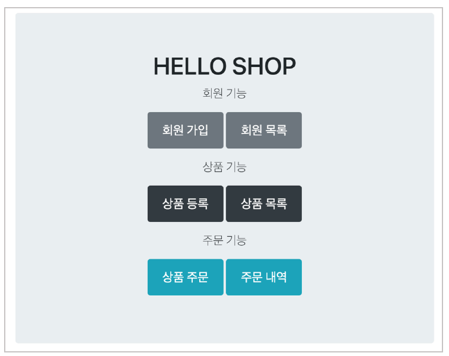
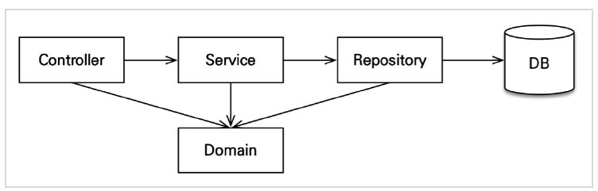

# 애플리케이션 구현 준비

## 구현 요구사항

- 회원 기능
  - 회원 등록
  - 회원 조회
- 상품 기능
  - 상품 등록
  - 상품 수정
  - 상품 조회
- 주문 기능
  - 상품 주문
  - 주문 내역 조회
  - 주문 취소

#### * 예제를 단순화 하기 위해 다음 기능은 구현X

- 로그인과 권한 관리X
- 파라미터 검증과 예외 처리X
- 상품은 도서만 사용
- 카테고리는 사용X
- 배송 정보는 사용X

## 애플리케이션 아키텍처

#### * 계층형 구조 사용

- controller, web: 웹 계층
- service: 비즈니스 로직, 트랜잭션 처리
- repository: JPA를 직접 사용하는 계층, 엔티티 매니저 사용
- domain: 엔티티가 모여 있는 계층, 모든 계층에서 사용

실용적인 측면에서 Controller에서 반드시 Service를 타서 Repository를 가지 않고, 필요에 따라 간단한 것들은 Controller에서 바로 Repository에 접근한다. (아키텍쳐를 너무 딱딱하게 가져가는것도 실용적인 측면에서 좋지는 않음.)

#### * 패키지 구조

- jpabook.jpashop
  - domain
  - exception
  - repository
  - service
  - web

**개발 순서: 서비스, 리포지토리 계층을 개발하고, 테스트 케이스를 작성해서 검증, 마지막에 웹 계층 적용**