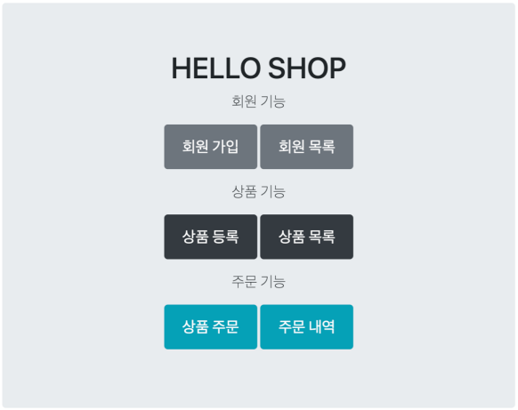
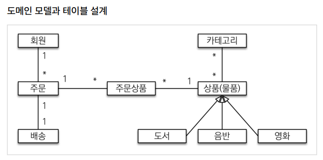
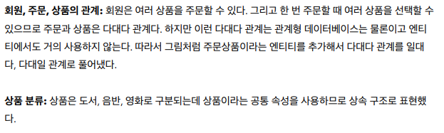
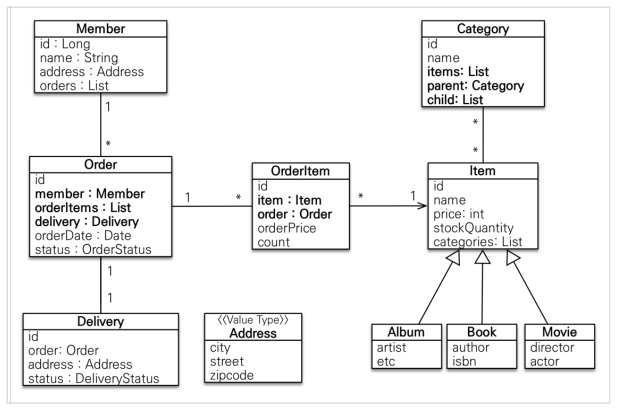
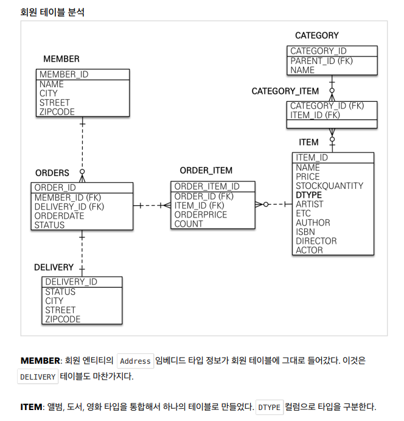
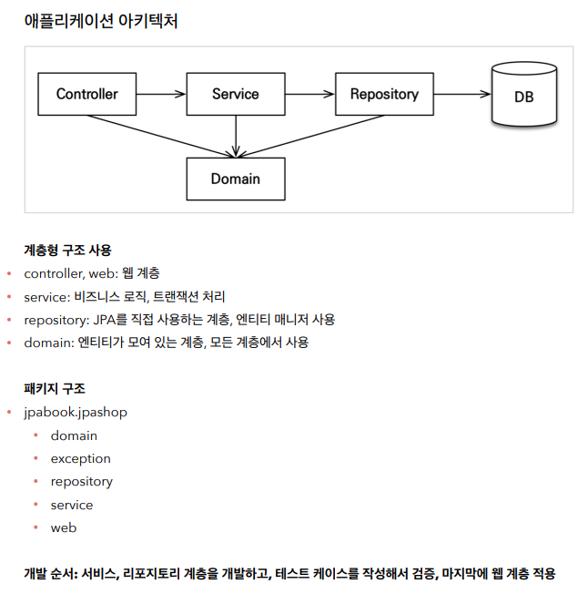

- 
기능 목록
------------------ 
- 회원 기능
  - 회원 등록
  - 회원 조회
- 상품 기능
  - 상품 등록
  - 상품 수정
  - 상품 조회
- 주문 기능
  - 상품 주문
  - 주문 내역 조회
  - 주문 취소
- 기타 요구사항
  - 상품은 재고 관리가 필요하다.
  - 상품의 종류는 도서, 음반, 영화가 있다.
  - 상품을 카테고리로 구분할 수 있다.
  - 상품 주문시 배송 정보를 입력할 수 있다.

- 
- 
- 
- 

엔티티 설계시 주의점
------------------ 
- 엔티티 설계시 주의점
  - 엔티티에는 가급적 Setter를 사용하지 말자
    - Setter가 모두 열려있다. 변경 포인트가 너무 많아서, 유지보수가 어렵다. 나중에 리펙토링으로 Setter 제거
  - 모든 연관관계는 지연로딩으로 설정!
    - 즉시로딩( EAGER )은 예측이 어렵고, 어떤 SQL이 실행될지 추적하기 어렵다. 특히 JPQL을 실행할 때 N+1
    문제가 자주 발생한다.
    - 실무에서 모든 연관관계는 지연로딩( LAZY )으로 설정해야 한다.
    - 연관된 엔티티를 함께 DB에서 조회해야 하면, fetch join 또는 엔티티 그래프 기능을 사용한다.
    - @XToOne(OneToOne, ManyToOne) 관계는 기본이 즉시로딩이므로 직접 지연로딩으로 설정해야 한
  다.

  - 컬렉션은 필드에서 초기화 하자.
    - 컬렉션은 필드에서 바로 초기화 하는 것이 안전하다.
    - null 문제에서 안전하다.
    - 하이버네이트는 엔티티를 영속화 할 때, 컬랙션을 감싸서 하이버네이트가 제공하는 내장 컬렉션으로 변경한
    다. 만약 getOrders() 처럼 임의의 메서드에서 컬력션을 잘못 생성하면 하이버네이트 내부 메커니즘에 문
    제가 발생할 수 있다. 따라서 필드레벨에서 생성하는 것이 가장 안전하고, 코드도 간결하다

  - 테이블, 컬럼명 생성 전략
    - 스프링 부트에서 하이버네이트 기본 매핑 전략을 변경해서 실제 테이블 필드명은 다름
    - https://docs.spring.io/spring-boot/docs/2.1.3.RELEASE/reference/htmlsingle/#howtoconfigure-hibernate-naming-strategy
    - http://docs.jboss.org/hibernate/orm/5.4/userguide/html_single/Hibernate_User_Guide.html#naming
    - 하이버네이트 기존 구현: 엔티티의 필드명을 그대로 테이블의 컬럼명으로 사용
      - ( SpringPhysicalNamingStrategy )
    - 스프링 부트 신규 설정 (엔티티(필드) 테이블(컬럼))
      1. 카멜 케이스 언더스코어(memberPoint member_point)
      2. .(점) _(언더스코어)
      3. 대문자 소문자
    - 적용 2 단계
      1. 논리명 생성: 명시적으로 컬럼, 테이블명을 직접 적지 않으면 ImplicitNamingStrategy 사용
         spring.jpa.hibernate.naming.implicit-strategy : 테이블이나, 컬럼명을 명시하지 않을 때 논리명
         적용,
      2. 물리명 적용:
         spring.jpa.hibernate.naming.physical-strategy : 모든 논리명에 적용됨, 실제 테이블에 적용
         (username usernm 등으로 회사 룰로 바꿀 수 있음)
    - 스프링 부트 기본 설정
      - spring.jpa.hibernate.naming.implicit-strategy:
      - org.springframework.boot.orm.jpa.hibernate.SpringImplicitNamingStrategy
      - spring.jpa.hibernate.naming.physical-strategy:
      - org.springframework.boot.orm.jpa.hibernate.SpringPhysicalNamingStrategy

구현 요구 사항
------------------
- 회원 기능
  - 회원 등록
  - 회원 조회
- 상품 기능
  - 상품 등록
  - 상품 수정
  - 상품 조회
- 주문 기능
  - 상품 주문
  - 주문 내역 조회
  - 주문 취소
- 예제를 단순화 하기 위해 다음 기능은 구현X
  - 로그인과 권한 관리X
  - 파라미터 검증과 예외 처리X
  - 상품은 도서만 사용
  - 카테고리는 사용X
  - 배송 정보는 사용X

어플리케이션 아키텍처
------------------
- 

추가 내용 정리
------------------
- 도메인 모델 패턴 : 엔티티가 비즈니스 로직을 가지고 객체 지향의 특성을 적극 활용하는 것 (http://martinfowler.com/eaaCatalog/domainModel.html)
- 트랜잭션 스크립트 패턴 : 엔티티에는 비즈니스 로직이 거의 없고 서비스 계층에서 대부분의 비즈니스 로직을 처리하는 것 (http://martinfowler.com/eaaCatalog/transactionScript.html)

변경 감지와 병합(merge)
------------------
- 준영속 엔티티?
  - 영속성 컨텍스트가 더는 관리하지 않는 엔티티를 말한다.
  - 준영속 엔티티를 수정하는 2가지 방법
    - 변경 감지 기능 사용
    - 병합( merge ) 사용
    - 변경 감지 기능 사용
    

    > 영속성 컨텍스트에서 엔티티를 다시 조회한 후에 데이터를 수정하는 방법
    트랜잭션 안에서 엔티티를 다시 조회, 변경할 값 선택 트랜잭션 커밋 시점에 변경 감지(Dirty Checking)이 동작해서 데이터베이스에 UPDATE SQL 실행

    > 병합 사용 
    병합은 준영속 상태의 엔티티를 영속 상태로 변경할 때 사용하는 기능이다.
    @Transactional
    void update(Item itemParam) { //itemParam: 파리미터로 넘어온 준영속 상태의 엔티티
    Item mergeItem = em.merge(item);
    }
    
- 병합 동작 방식
  1. merge() 를 실행한다.
  2. 파라미터로 넘어온 준영속 엔티티의 식별자 값으로 1차 캐시에서 엔티티를 조회한다.
     1. 만약 1차 캐시에 엔티티가 없으면 데이터베이스에서 엔티티를 조회하고, 1차 캐시에 저장한다.
  3. 조회한 영속 엔티티( mergeMember )에 member 엔티티의 값을 채워 넣는다. (member 엔티티의 모든 값
     을 mergeMember에 밀어 넣는다. 이때 mergeMember의 “회원1”이라는 이름이 “회원명변경”으로 바
     뀐다.)
  4. 영속 상태인 mergeMember를 반환한다.

- 병합시 동작 방식을 간단히 정리
  1. 준영속 엔티티의 식별자 값으로 영속 엔티티를 조회한다.
  2. 영속 엔티티의 값을 준영속 엔티티의 값으로 모두 교체한다.(병합한다.)
  3. 트랜잭션 커밋 시점에 변경 감지 기능이 동작해서 데이터베이스에 UPDATE SQL이 실행

> 주의: 변경 감지 기능을 사용하면 원하는 속성만 선택해서 변경할 수 있지만, 병합을 사용하면 모든 속성이 변경된다. 병합시 값이 없으면 null 로 업데이트 할 위험도 있다. (병합은 모든 필드를 교체한다.)
 

- 가장 좋은 해결 방법
  - 엔티티를 변경할 때는 항상 변경 감지를 사용하세요
  - 컨트롤러에서 어설프게 엔티티를 생성하지 마세요.
  - 트랜잭션이 있는 서비스 계층에 식별자( id )와 변경할 데이터를 명확하게 전달하세요.(파라미터 or dto)
  - 트랜잭션이 있는 서비스 계층에서 영속 상태의 엔티티를 조회하고, 엔티티의 데이터를 직접 변경하세요.
  - 트랜잭션 커밋 시점에 변경 감지가 실행됩니다